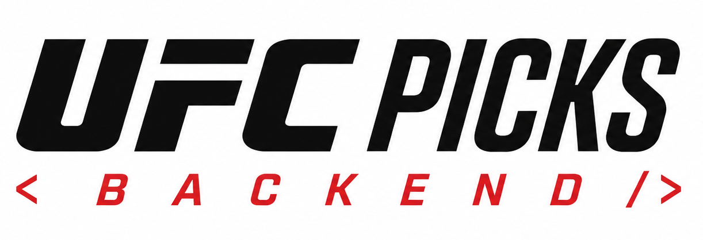

<div align="center">



# UFC Picks — API

### The prediction, scoring, and leaderboard engine behind UFC Picks.

FastAPI service for Google authentication, UFC event data, fight predictions,
automated scoring, and competitive rankings.

<br>

[](https://www.python.org/)
[](https://fastapi.tiangolo.com/)
[](https://www.mongodb.com/)
[](https://developers.google.com/identity)

<sub>Events · Picks · Scoring · Statistics · Leaderboards · Administration</sub>

</div>

## Responsibilities

- Authenticate users with Google and issue JWT sessions.
- Serve events, fight cards, bouts, fighters, and user profiles.
- Accept and validate winner, method, and round predictions.
- Calculate scores and maintain global and event leaderboards.
- Provide administrative result, card, timing, and media operations.
- Rate-limit requests and serve health checks.

## Scoring system

| Prediction | Points |
| --- | ---: |
| Correct winner | 1 |
| Correct method | +1 |
| Correct round | +1 |
| Perfect pick | 3 |

An incorrect winner receives no points. Round points apply only when the result
has a round to match, so a decision cannot receive a round bonus.

## Architecture

The application uses a layered design: FastAPI controllers handle HTTP,
services coordinate domain operations, repositories encapsulate MongoDB access,
and schemas define its request and response contracts. Optional S3 and
CloudFront integration provides durable fighter and event media delivery.

## API reference

When running locally:

- Swagger UI: [http://localhost:8000/docs](http://localhost:8000/docs)
- ReDoc: [http://localhost:8000/redoc](http://localhost:8000/redoc)

The interactive reference is the source of truth for endpoints and request
schemas.

## Getting started

### Prerequisites

- Python 3.11 or later
- MongoDB Atlas or a compatible MongoDB instance
- Google OAuth credentials

### Run locally

```bash
git clone https://github.com/JoseZum/ufc-picks-backend.git
cd ufc-picks-backend
python -m venv .venv
# Windows PowerShell: .venv\Scripts\Activate.ps1
# macOS/Linux: source .venv/bin/activate
pip install -r requirements.txt
Copy-Item .env.example .env  # Windows PowerShell
uvicorn app.main:app --reload
```

On macOS or Linux, replace the copy command with `cp .env.example .env`.

## Configuration

Set `MONGODB_URI`, `JWT_SECRET`, `GOOGLE_CLIENT_ID`, and
`GOOGLE_CLIENT_SECRET` in `.env`. Review [`.env.example`](.env.example) for
the full set of configuration options, including CORS and optional S3/
CloudFront media delivery.

## Testing and quality

```bash
pytest
ruff check .
mypy app
bandit -r app
```

## Deployment

The repository contains a [Render Blueprint](render.yaml) for the API. Set all
secret values in the Render dashboard; do not commit production credentials.

## UFC Picks ecosystem

- [Platform overview](https://github.com/JoseZum/ufc-picks)
- [Web App](https://github.com/JoseZum/ufc-picks-frontend)
- [API](https://github.com/JoseZum/ufc-picks-backend)
- [Data Pipeline](https://github.com/JoseZum/ufc-picks-scraper)

<div align="center">

`ingest → predict → score → rank`

</div>
